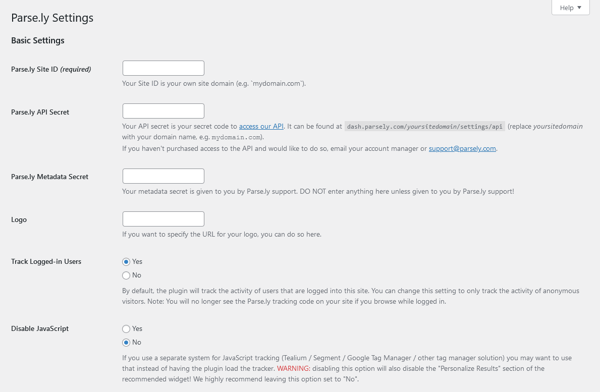
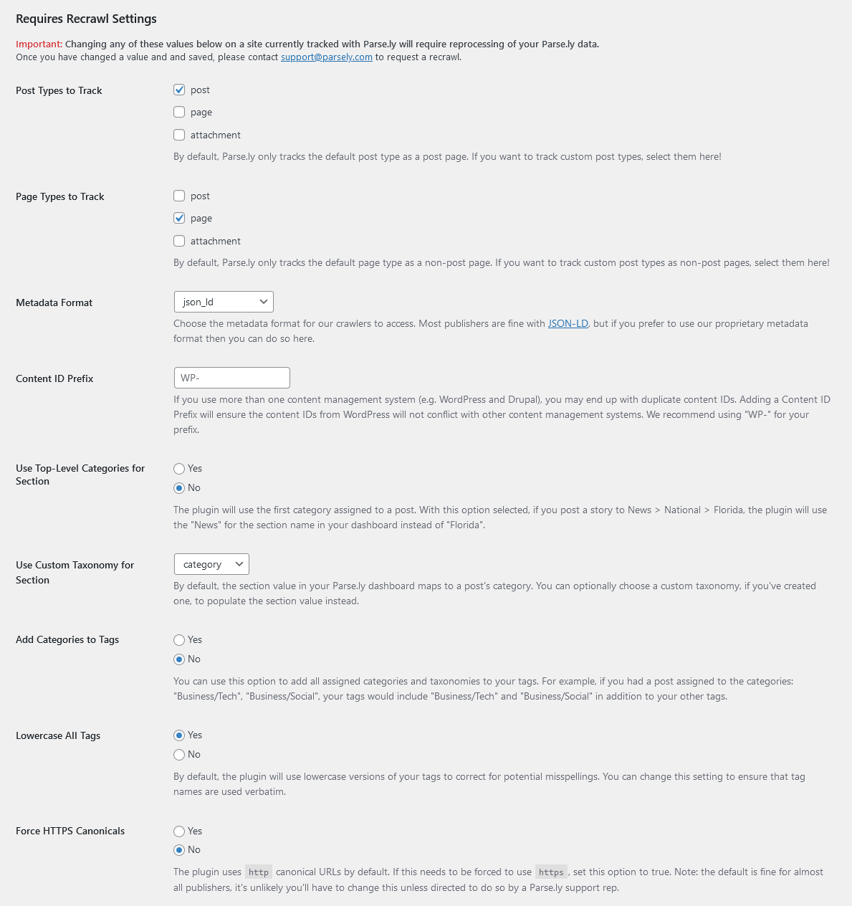
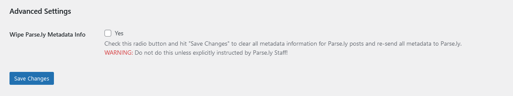
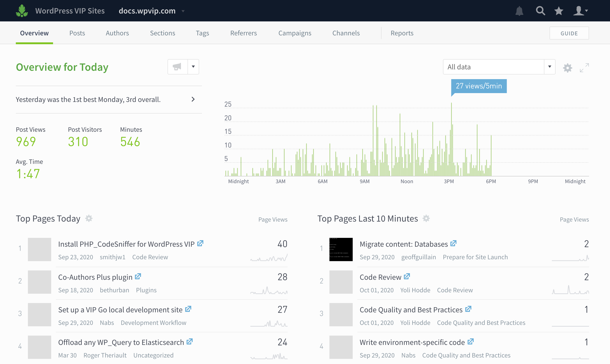

# Parse.ly

Stable tag: 3.1.2  
Requires at least: 5.0  
Tested up to: 5.9.1  
Requires PHP: 7.1  
License: GPLv2 or later  
Tags: analytics, parse.ly, parsely, parsley  
Contributors: parsely, hbbtstar, jblz, mikeyarce, GaryJ, parsely_mike, pauargelaguet, acicovic

The Parse.ly plugin facilitates real-time and historical analytics to your content through a platform designed and built for digital publishing.

## Description

Designed and built for digital publishers, Parse.ly helps you understand how your audience is connecting to your content.

Thousands of writers, editors, site managers, and technologists already use Parse.ly to understand what content draws in website visitors, and why. Using our powerful dashboards and APIs, customers build successful digital strategies that allow them to grow and engage a loyal audience.

Join industry leaders -- like Mashable, Slate, News Corp, and Conde Nast -- who already use Parse.ly to bring clarity to content, audience, and analytics.

### Features

- Get started with Parse.ly right away: the plugin automatically inserts the required metadata and JavaScript on all your published pages and posts.
- Choose what format the metadata takes, and whether logged-in users should be included in the analytics.
- Using it in a decoupled setup? Parse.ly adds metadata to the REST API output for pages, posts and optionally other object types.
- If you've purchased access to the Parse.ly API, add a widget to your site with article recommendations personalized to individual users.

Feedback, suggestions, questions or concerns? Open a new [GitHub issue](https://github.com/Parsely/wp-parsely/issues) or email us at [support@parsely.com](mailto:support@parsely.com). We always want to hear from you!

## Installation

The plugin requires an active Parse.ly account. Parse.ly gives creators, marketers, and developers the tools to understand content performance, prove content value, and deliver tailored content experiences that drive meaningful results. [Sign up for a free demo of Parse.ly](https://www.parsely.com/getdemo?utm_medium=referral&utm_source=wordpress.org&utm_content=wp-parsely).

### Install the plugin from within WordPress

1. Visit the Plugins page from your WordPress dashboard and click "Add New" at the top of the page.
2. Search for _parse.ly_ using the search bar on the right side.
3. Click _Install Now_ to install the plugin.
4. After it's installed, click _Activate_ to activate the plugin on your site.

### Install the plugin manually

1. Download the plugin from [WordPress.org](https://wordpress.org/plugins/wp-parsely/) or get the latest release from our [Github Releases page](https://github.com/Parsely/wp-parsely/releases).
2. Unzip the downloaded archive.
3. Upload the entire `wp-parsely` folder to your `/wp-content/plugins` directory.
4. Visit the Plugins page from your WordPress dashboard and look for the newly installed Parse.ly plugin.
5. Click _Activate_ to activate the plugin on your site.

## Local development

To run the plugin locally or to contribute to it, please check the instructions in the [CONTRIBUTING](CONTRIBUTING.md) file.

## REST API

The plugin adds a `parsely` field to certain REST API responses. This can be disabled by returning `false` from the `wp_parsely_enable_rest_api_support` filter.

Example:

```
// Disable all REST API output from the Parse.ly plugin.
add_filter( 'wp_parsely_enable_rest_api_support', '__return_false' );
```

The plugin adds the `parsely` field to endpoints corresponding to the Tracked Post Types and Tracked Page Types selected in the plugin settings. By default, this would be the `/wp-json/wp/v2/pages` and `/wp-json/wp/v2/posts` endpoints along with the corresponding single resource endpoints.

This choice of objects types can be further changed by using the `wp_parsely_rest_object_types` filter.

Example:

```
// Disable REST API output from pages, but enable for term archives.
add_filter(
	'wp_parsely_rest_object_types',
	function( $object_types ) {
		$object_types = array_diff( $object_types, array( 'page' ) );
		$object_types[] = 'term';
		return $object_types;
	}
);
```

The `parsely` field contains the following fields:
 - `version`, which is a string identifying the version of the REST API output; this will be updated if changes are made to the output, so consuming applications can check against it.
 - `meta`, which is an array of metadata for the specific post, page or other object type.
 - `rendered`, which is the rendered HTML of the metadata for the post, page or other object type. This will be a JSON-LD `<script>` tag, or a set of `<meta>` tags, depending on the format selected in the plugin settings. The decoupled code can consume and use this directly, instead of building the values from the `meta` field values.

The `rendered` field is a convenience field containing the HTML-formatted metadata which can be printed to a decoupled page as is.

This can be disabled by returning `false` from the `wp_parsely_enable_rest_rendered_support` filter.

Example:

```
// Disable rendered field output from the REST API output.
add_filter( 'wp_parsely_enable_rest_rendered_support', '__return_false' );
```

## Frequently Asked Questions

### Where do I find my Site ID?

Your Site ID is likely your own site domain name (e.g., `mysite.com`). You can find this in your Parse.ly account.

### Why can't I see Parse.ly code on my post when I preview?

The code will only be placed on posts and pages which have been published in WordPress to ensure we don't track traffic generated while you're still writing a post or page.

You may also be not tracking logged-in users, via one of the settings.

### How can I edit the values passed to the JSON-LD metadata?

You can use the `wp_parsely_metadata` filter, which sends three arguments: the array of metadata, the post object, and the `parsely_options` array:

    add_filter( 'wp_parsely_metadata', 'filter_parsely_metadata', 10, 3 );
    function filter_parsely_metadata( $parsely_metadata, $post, $parsely_options ) {
        $parsely_metadata['articleSection'] = '...'; // Whatever values you want Parse.ly's Section to be.
        return $parsely_metadata;
    }

This filter can go anywhere in your codebase, provided it always gets loaded.

### Is the plugin compatible with AMP and Facebook Instant Articles?

It is! The plugin hooks into Automattic's official plugins for [AMP](https://wordpress.org/plugins/amp/) and [Facebook Instant Articles](https://wordpress.org/plugins/fb-instant-articles/).

AMP support is enabled automatically if the Automattic AMP plugin is installed.

For Facebook Instant Articles support, enable "Parsely Analytics" in the "Advanced Settings" menu of the Facebook Instant Articles plugin.

### Does the plugin support dynamic tracking?

This plugin does not currently support dynamic tracking (the tracking of multiple pageviews on a single page).

Some common use-cases for dynamic tracking are slideshows or articles loaded via AJAX calls in single-page applications -- situations in which new content is loaded without a full page refresh.

Tracking these events requires manually implementing additional JavaScript above [the standard Parse.ly include](http://www.parsely.com/help/integration/basic/) that the plugin injects into your page source. Please consult [the Parse.ly documentation on dynamic tracking](https://www.parsely.com/help/integration/dynamic/) for instructions on implementing dynamic tracking, or contact Parse.ly support for additional assistance.

### Cloudflare support

If the site is running behind a Cloudflare DNS, their Rocket Loader technology will alter how JavaScript files are loaded. [A JavaScript file can be ignored by Rocket Loader](https://support.cloudflare.com/hc/en-us/articles/200169436-How-can-I-have-Rocket-Loader-ignore-specific-JavaScripts) by using `data-cfasync="false"`.

Previous versions of this plugin would mark all scripts with that tag by default. Starting in version 3.0, that behavior has become optional and scripts won't be annotated with `data-cfasync="false"`. The previous behavior can be restored by adding the following filter:

```
add_filter( 'wp_parsely_enable_cfasync_attribute', '__return_true' );
```

## Screenshots

1. Parse.ly plugin main settings for easy setup. For the plugin to start working, only the website ID is needed.  
   
2. Parse.ly plugin settings that require you to submit a website recrawl request whenever you update them.  
   
3. Parse.ly plugin advanced settings. To be used only if instructed by Parse.ly staff.  
   
4. The settings for the Parse.ly Recommended Widget. Engage your visitors with predictive and personalized recommendations from Parse.ly.  
   
5. A view of the Parse.ly Dashboard Overview. Parse.ly offers analytics that empowers you to better understand how your content is peforming.  
   

## Sample Parse.ly metadata

The standard Parse.ly JavaScript tracker inserted before the closing `body` tag:

    <script id="parsely-cfg" data-parsely-site="example.com" src="https://cdn.parsely.com/keys/example.com/p.js"></script>

A sample `JSON-LD` structured data for a home page or section page:

    <script type="application/ld+json">
    {"@context":"http:\/\/schema.org","@type":"WebPage","headline":"WordPress VIP","url":"http:\/\/wpvip.com\/"}
    </script>

A sample `JSON-LD` meta tag and structured data for an article or post:

    <script type="application/ld+json">
    {"@context":"http:\/\/schema.org","@type":"NewsArticle","mainEntityOfPage":{"@type":"WebPage","@id":"http:\/\/wpvip.com\/2021\/04\/09\/how-the-wordpress-gutenberg-block-editor-empowers-enterprise-content-creators\/"},"headline":"How the WordPress Gutenberg Block Editor Empowers Enterprise Content Creators","url":"http:\/\/wpvip.com\/2021\/04\/09\/how-the-wordpress-gutenberg-block-editor-empowers-enterprise-content-creators\/","thumbnailUrl":"https:\/\/wpvip.com\/wp-content\/uploads\/2021\/04\/ladyatdesk.png?w=120","image":{"@type":"ImageObject","url":"https:\/\/wpvip.com\/wp-content\/uploads\/2021\/04\/ladyatdesk.png?w=120"},"dateCreated":"2021-04-09T15:13:13Z","datePublished":"2021-04-09T15:13:13Z","dateModified":"2021-04-09T15:13:13Z","articleSection":"Gutenberg","author":[{"@type":"Person","name":"Sam Wendland"}],"creator":["Sam Wendland"],"publisher":{"@type":"Organization","name":"The Enterprise Content Management Platform | WordPress VIP","logo":"https:\/\/wpvip.com\/wp-content\/uploads\/2020\/11\/cropped-favicon-dark.png"},"keywords":[]}
    </script>

## Changelog

See the [change log](https://github.com/parsely/wp-parsely/blob/trunk/CHANGELOG.md).
